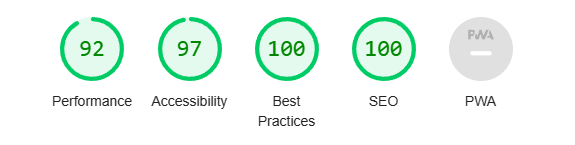
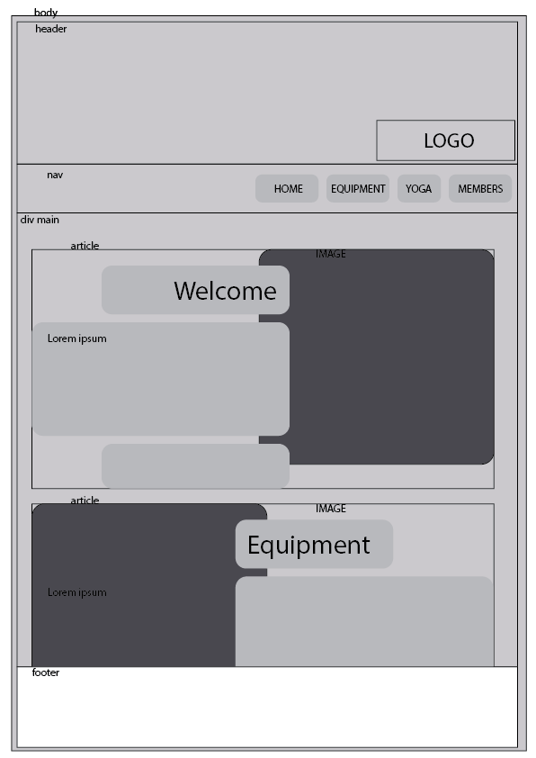

# Miller Musle Mansion.
--------------------------------------------------------------------------------
My project for CI-FSD-2023-no. 
I wanted to challange the regular gym sites with its rough and hard edges and play with a more rounded and inviting feel. By using muted, earth colours and only slight deviations in colour palette i try to embrace the visitor. 

### The Header
--------------------------------------------------------------------------------

### Lighthouse Score

### Wireframe 

#### Tools
--------------------------------------------------------------------------------
Mainly VS code, i found codeanywhere to be slow, and unreliable.
Illustror for the wireframe. 

### REFS
--------------------------------------------------------------------------------
W3 School have been a real goldmine. 
I have used, and modifed code for my buttons by adding backdround, and hover slide colors. 

Yoga events are a version of the one from Code Institutes Love Running project. 

All the images are from  [Pexels](https://www.pexels.com) 

### LINKS 

| OBJECT | LINK |
| ------ | ------ |
| BUTTONS | <https://www.w3schools.com/csS/css3_buttons.asp> |
| PARALLAX | <https://www.w3schools.com/howto/howto_css_parallax.asp> |
| IMAGES | https://www.pexels.com/ |
| FORM | <https://www.w3schools.com/howto/howto_css_contact_section.asp> |

### BUGS 
I found that my main sticks out behind the right scrollbar, my only solution was to just hide it with overflow-x hidden. Really bad hack but it serves its purpose.  

### DEPLOYMENT
--------------------------------------------------------------------------------
The site was deployed to GitHub pages. 
In the GitHub repository click the Settings Tab (cogwheel)
Go to the Pages section on the left side. 
Choose Master/Main-branch, hit save and a link will appear. 

The live link lives here | [Miller Muscle Mansion](https://zakenaio.github.io/ci2023dfs-p1-site-main/)

--------------------------------------------------------------------------------
[Code Institute](https://codeinstiture.net)
