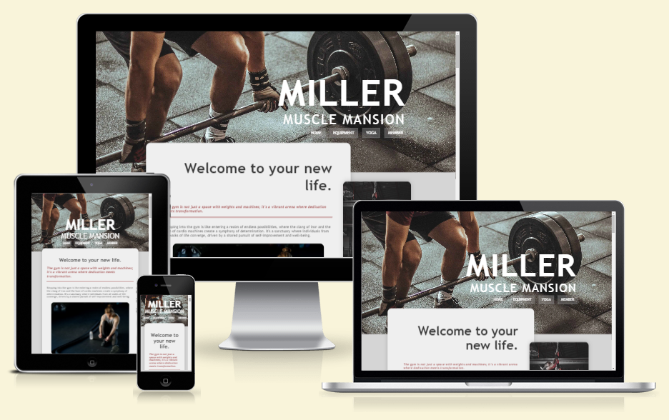
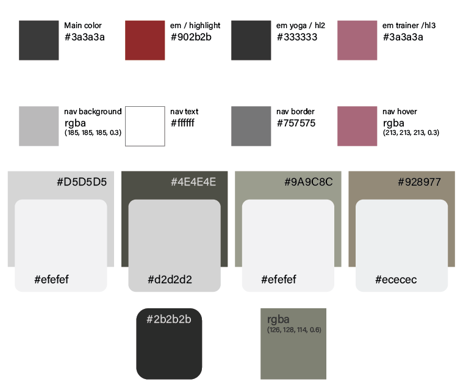
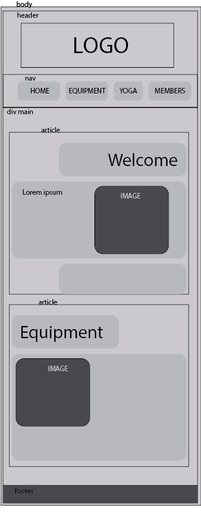
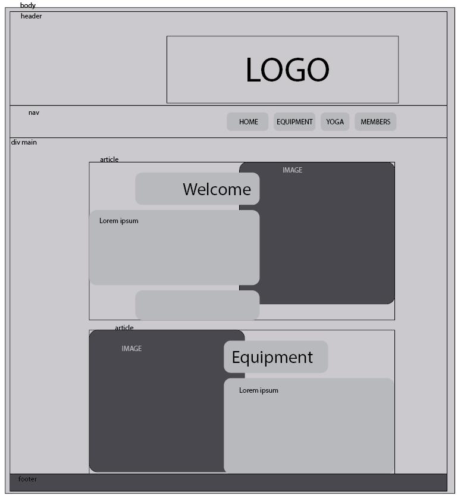
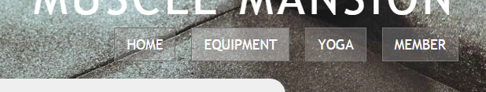
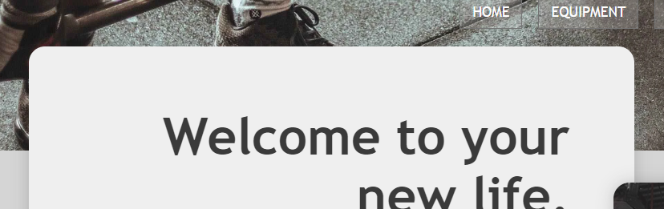
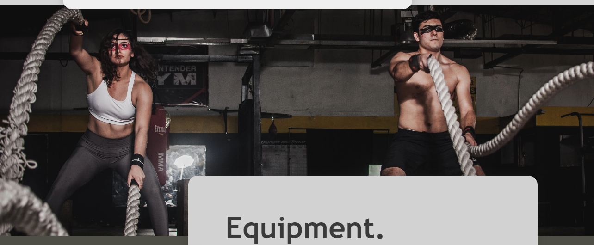
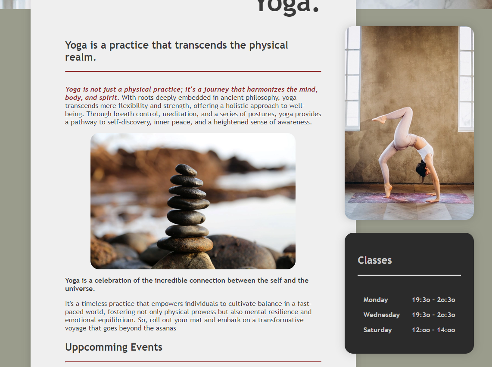

# [MILLER MUSCLE MANSION ](https://zakenaio.github.io/ci2023dfs-p1-site-main)

I wanted to challange the regular gym sites with its rough and hard edges and play with a more rounded and inviting feel. 
By using muted, earth colours and only slight deviations in colour palette to embrace the visitor. 

The purpose was to make fitness more appealing to everyone, without being to aggressive.

## UX

I decided to go with a one page structure with nav at the top under the logo/header. 
Logo and nav changes size and position dynamicly depending on resolution. 
Center over content for mobile, and larger slightly to the right on desktop. 

### Colour Scheme

I wanted muted, earth colors for 

- `#3a3a3a` used for primary text.
- `#4A4A4F` used for primaty highlight.
- `#009FE3` used for secondary highlights.
- `#009FE3` used for third highlights.

- `#3a3a3a` used for navigation background.
- `#4A4A4F` used for navigation text.
- `#009FE3` used for navigation border.
- `#009FE3` used for navigation hover.

- `#D5D5D5` used for home/welcome background.
- `#efefef` used for home/welcome rounded section.
- `#4E4E4E` used for equipment background.
- `#d2d2d2` used for qeuipment rounded section.
- `#9A9C8C` used for yoga background.
- `#efefef` used for yoga rounded section.
- `#928977` used for member background.
- `#ececec` used for member rounded section.

- `#2b2b2b` used for dark blobs.
- `rgba 126, 128, 114, 0.6` used for overlay on yoga events.

### Typography

**Trebuchet MS, Lucida Sans Unicode, Lucida Grande, Lucida Sans, Arial, sans-serif.**

Trebuchet MS Trebuchet MS has a modern and elegant appearance, making it suitable for contemporary websites. Readable at Small Sizes: It maintains readability even at smaller font sizes, ensuring a positive user experience on various devices.

## Wireframes

My initial idea deviates slightly from the final result, but its close. 
I struggled with the right feel, so i made one single section for 
every part, instead of having h2 in one, content in one underneath. 
I believe it was the right choice, simpler, easier on the eyes. 

### Mobile Wireframes

 Click here to see the Mobile Wireframe 

### Tablet Wireframes

 Click here to see the Tablet Wireframe 

### Desktop Wireframes

 Click here to see the Desktop Wireframe 

## Features

Semi-transparent nav should stand out, without being to intrusive. 

Content sections overlap the parallaxed section deviders for a cohesive feel.  

Side images and content got their separate sections slightly ontop of the main content with the same rounded corners to keep the feel. 

## Tools & Technologies Used

- [HTML](https://en.wikipedia.org/wiki/HTML) used for the main site content.
- [CSS](https://en.wikipedia.org/wiki/CSS) used for the main site design and layout.
- [CSS Flexbox](https://www.w3schools.com/css/css3_flexbox.asp) used for an enhanced responsive layout.
- [JavaScript](https://www.javascript.com) used for user interaction on the site.
- [Git](https://git-scm.com) used for version control. (`git add`, `git commit`, `git push`)
- [GitHub](https://github.com) used for secure online code storage.
- [GitHub Pages](https://pages.github.com) used for hosting the deployed front-end site.
- [Markdown Builder](https://tim.2bn.dev/markdown-builder) | README and TESTING | tool to help generate the Markdown files |

### Media

##Images from pexels. 

Header 
[Header image](https://www.pexels.com/photo/person-holding-black-and-silver-steel-barbell-photography-949126/ "Header image from Pexels")

Side image Welcome/Home
[Side image Home](https://www.pexels.com/photo/man-climbing-on-rope-2468339/ "Side image from Pexels")

Inside image Welcome/Home
[Inside image Home](https://www.pexels.com/photo/man-sitting-on-the-floor-and-tying-his-shoes-4164651/  "Inside image from Pexels")

Equipment Section Parallax
[Equipment section Parallax image](https://www.pexels.com/photo/man-and-woman-holding-battle-ropes-1552242/ "Equipment section parallax image from Pexels")

Side image Equipment
[Side image Equipment](https://www.pexels.com/photo/person-taking-dumbbells-from-a-rack-4164849/ "Side image equipment from Pexels")

Trainer image Equipment
[Trainer image Equipment](https://www.pexels.com/photo/woman-holding-exercise-equipment-416809/ "Trainer image equipment from Pexels")

Yoga Section Parallax
[Yoga Parallax section image](https://www.pexels.com/photo/woman-meditating-with-candles-and-incense-3822864/ "Yoga parallax section image from Pexels")

Side image Yoga
[Side image Yoga](https://www.pexels.com/photo/woman-practicing-yoga-3822455/ "Side image yoga from Pexels")

Inside image Yoga
[Inside image Yoga](https://www.pexels.com/photo/balance-blur-boulder-close-up-355863/ "Inside image yofa from Pexels")

Yoga Events image
[Yoga Events image](https://www.pexels.com/sv-se/foto/halsosam-manniskor-avslappning-kvinnor-4056723/ "Yoga events image from Pexels")

Member Section Parallax
[Member Parallax section image](https://www.pexels.com/photo/fit-smiling-sportswoman-waiting-at-gym-reception-desk-3757941/ "Member section parallax image from Pexels")

Side image Members
[Side image Members](https://www.pexels.com/photo/wake-up-and-workout-slogan-on-light-box-among-sports-equipment-4397840/ "Side image members from Pexels")

## Testing

For all testing, please refer to the [TESTING.md](TESTING.md) file.

## Deployment

The site was deployed to GitHub Pages. The steps to deploy are as follows:

- In the [GitHub repository](https://github.com/zakenaio/ci2023dfs-p1-site-main), navigate to the Settings tab 
- From the source section drop-down menu, select the **Main** Branch, then click "Save".
- The page will be automatically refreshed with a detailed ribbon display to indicate the successful deployment.

The live link can be found [here](https://zakenaio.github.io/ci2023dfs-p1-site-main)

### Local Deployment

This project can be cloned or forked in order to make a local copy on your own system.

#### Cloning

You can clone the repository by following these steps:

1. Go to the [GitHub repository](https://github.com/zakenaio/ci2023dfs-p1-site-main) 
2. Locate the Code button above the list of files and click it 
3. Select if you prefer to clone using HTTPS, SSH, or GitHub CLI and click the copy button to copy the URL to your clipboard
4. Open Git Bash or Terminal
5. Change the current working directory to the one where you want the cloned directory
6. In your IDE Terminal, type the following command to clone my repository:
	- `git clone https://github.com/zakenaio/ci2023dfs-p1-site-main.git`
7. Press Enter to create your local clone.

Alternatively, if using Gitpod, you can click below to create your own workspace using this repository.

Please note that in order to directly open the project in Gitpod, you need to have the browser extension installed.
A tutorial on how to do that can be found [here](https://www.gitpod.io/docs/configure/user-settings/browser-extension).

#### Forking

By forking the GitHub Repository, we make a copy of the original repository on our GitHub account to view and/or make changes without affecting the original owner's repository.
You can fork this repository by using the following steps:

1. Log in to GitHub and locate the [GitHub Repository](https://github.com/zakenaio/ci2023dfs-p1-site-main)
2. At the top of the Repository (not top of page) just above the "Settings" Button on the menu, locate the "Fork" Button.
3. Once clicked, you should now have a copy of the original repository in your own GitHub account!

### Acknowledgements

- I would like to thank my Code Institute mentor, [Tim Nelson](https://github.com/TravelTimN) for their support throughout the development of this project.
- I would like to thank the [Code Institute](https://codeinstitute.net) tutor team for their assistance with troubleshooting and debugging some project issues.
- I would like to thank the [Code Institute Slack community](https://code-institute-room.slack.com) for the moral support; it kept me going during periods of self doubt and imposter syndrome.

### Credits

| OBJECT | LINK |
| ------ | ------ |
| BUTTONS | <https://www.w3schools.com/csS/css3_buttons.asp> |
| TOP BUTTON | <https://www.w3schools.com/howto/howto_js_scroll_to_top.asp> |
| PARALLAX | <https://www.w3schools.com/howto/howto_css_parallax.asp> |
| IMAGES | <https://www.pexels.com/> |
| FORM | <https://www.w3schools.com/howto/howto_css_contact_section.asp> |