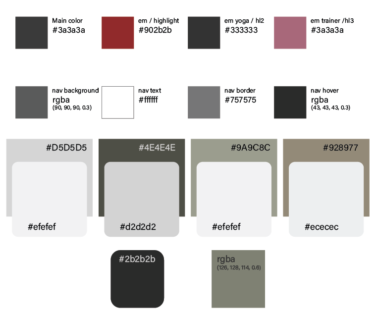
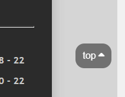

# [MILLER MUSCLE MANSION ](https://zakenaio.github.io/ci2023dfs-p1-site-main)

I aimed to disrupt the typical gym website aesthetics characterized by harsh edges, opting for a softer, rounded, and more welcoming vibe. Employing muted earth tones and subtle shifts in the color palette, the goal was to create an environment that embraces visitors. This approach sought to redefine fitness as inclusive and less intimidating, making it more appealing to a broader audience by avoiding excessive aggression in design.

## UX

I chose a streamlined one-page structure for the website, positioning the navigation under the logo/header at the top. To ensure adaptability across resolutions, the logo and navigation dynamically adjust in both size and position. On mobile devices, they center over the content for a clean and accessible layout, while on desktops, they scale slightly larger and shift to the right for optimized visibility and user experience. This responsive design approach aims to provide a seamless and user-friendly interface, accommodating various devices and screen sizes.

## Colour Scheme

The color choices were carefully selected to create a cohesive and visually appealing website design:

#### Text and Highlights:
- `#3a3a3a` for primary text ensures a readable and balanced contrast against the background.
- `#4A4A4F` serves as the primary highlight, providing a subtle yet distinct emphasis.
- `#009FE3` `#009FE3` for secondary and tertiary highlights, respectively, maintain a consistent and vibrant color scheme.

#### Navigation:
- `#3a3a3a` as the background provides a neutral base for navigation, ensuring readability.
- `#4A4A4F` for navigation text maintains a clear contrast against the background.
- `#009FE3` for navigation border and hover effect adds a dynamic and engaging element.

#### Sections:
- `#D5D5D5` for the home/welcome background creates a welcoming and neutral atmosphere.
- `#efefef` for rounded sections in the home/welcome and yoga sections adds a touch of softness and continuity.
- `#4E4E4E` or equipment background and `#d2d2d2` for rounded sections convey a balanced and professional aesthetic.
- `#9A9C8C` used for yoga background.
- `#928977` for the member background and `#ececec` for the rounded section maintain a warm and inviting feel.

#### Special Elements:
- `#2b2b2b` for dark blobs adds a bold and contrasting visual element.
- `rgba 126, 128, 114, 0.6` as an overlay on yoga events creates a subtle and immersive effect, enhancing the overall visual appeal.

## Typography

**Trebuchet MS, Lucida Sans Unicode, Lucida Grande, Lucida Sans, Arial, sans-serif.**

Trebuchet MS Trebuchet MS has a modern and elegant appearance, making it suitable for contemporary websites. Readable at Small Sizes: It maintains readability even at smaller font sizes, ensuring a positive user experience on various devices.

## Wireframes

My initial idea deviates slightly from the final result, but its close. 
I struggled with the right feel, so i made one single section for 
every part, instead of having h2 in one, content in one underneath. 
I believe it was the right choice, simpler, easier on the eyes. 

### Mobile Wireframes

 Click here to see the Mobile Wireframe 

### Tablet Wireframes

 Click here to see the Tablet Wireframe 

### Desktop Wireframes

 Click here to see the Desktop Wireframe 

## Features

Semi-transparent navigation buttons enhance user experience by providing subtle visibility without obstructing content, fostering an elegant design. This promotes intuitive navigation, maintaining a balance between aesthetics and functionality for a seamless browsing experience.

Integrating rounded sections and overlapping content with section dividers on a website achieves a dynamic and modern design. The rounded sections soften visuals, adding an inviting feel, while overlapping content enhances continuity, guiding users through a seamless and engaging browsing experience. This cohesive approach elevates overall aesthetics and fosters positive user interaction.

By placing side images and content in separate sections slightly above the main content, all with rounded corners, we maintain a unified and modern design. This consistent look enhances user experience, providing a visually appealing and approachable website layout.

Enhances user experience by providing convenient, accessible navigation, saving time, ensuring consistency, and adding aesthetic appeal during scrolling.

## Tools & Technologies Used

- [HTML](https://en.wikipedia.org/wiki/HTML) used for the main site content.
- [CSS](https://en.wikipedia.org/wiki/CSS) used for the main site design and layout.
- [CSS Flexbox](https://www.w3schools.com/css/css3_flexbox.asp) used for an enhanced responsive layout.
- [JavaScript](https://www.javascript.com) used for user interaction on the site.
- [Git](https://git-scm.com) used for version control. (`git add`, `git commit`, `git push`)
- [GitHub](https://github.com) used for secure online code storage.
- [GitHub Pages](https://pages.github.com) used for hosting the deployed front-end site.
- [Markdown Builder](https://tim.2bn.dev/markdown-builder) | README and TESTING | tool to help generate the Markdown files |

## Testing

For all testing, please refer to the [TESTING.md](TESTING.md) file.

## Deployment

The site was deployed to GitHub Pages. The steps to deploy are as follows:

- In the [GitHub repository](https://github.com/zakenaio/ci2023dfs-p1-site-main), navigate to the Settings tab 
- From the source section drop-down menu, select the **Main** Branch, then click "Save".
- The page will be automatically refreshed with a detailed ribbon display to indicate the successful deployment.

The live link can be found [here](https://zakenaio.github.io/ci2023dfs-p1-site-main)

### Local Deployment

This project can be cloned or forked in order to make a local copy on your own system.

#### Cloning

You can clone the repository by following these steps:

1. Go to the [GitHub repository](https://github.com/zakenaio/ci2023dfs-p1-site-main) 
2. Locate the Code button above the list of files and click it 
3. Select if you prefer to clone using HTTPS, SSH, or GitHub CLI and click the copy button to copy the URL to your clipboard
4. Open Git Bash or Terminal
5. Change the current working directory to the one where you want the cloned directory
6. In your IDE Terminal, type the following command to clone my repository:
	- `git clone https://github.com/zakenaio/ci2023dfs-p1-site-main.git`
7. Press Enter to create your local clone.

Alternatively, if using Gitpod, you can click below to create your own workspace using this repository.

Please note that in order to directly open the project in Gitpod, you need to have the browser extension installed.
A tutorial on how to do that can be found [here](https://www.gitpod.io/docs/configure/user-settings/browser-extension).

#### Forking

By forking the GitHub Repository, we make a copy of the original repository on our GitHub account to view and/or make changes without affecting the original owner's repository.
You can fork this repository by using the following steps:

1. Log in to GitHub and locate the [GitHub Repository](https://github.com/zakenaio/ci2023dfs-p1-site-main)
2. At the top of the Repository (not top of page) just above the "Settings" Button on the menu, locate the "Fork" Button.
3. Once clicked, you should now have a copy of the original repository in your own GitHub account!

### Acknowledgements

- I would like to thank my Code Institute mentor, [Tim Nelson](https://github.com/TravelTimN) for their support throughout the development of this project.
- I would like to thank the [Code Institute](https://codeinstitute.net) tutor team for their assistance with troubleshooting and debugging some project issues.
- I would like to thank the [Code Institute Slack community](https://code-institute-room.slack.com) for the moral support; it kept me going during periods of self doubt and imposter syndrome.

### Credits

| OBJECT | LINK |
| ------ | ------ |
| BUTTONS | <https://www.w3schools.com/csS/css3_buttons.asp> |
| TOP BUTTON | <https://www.w3schools.com/howto/howto_js_scroll_to_top.asp> |
| PARALLAX | <https://www.w3schools.com/howto/howto_css_parallax.asp> |
| IMAGES | <https://www.pexels.com/> |
| FORM | <https://www.w3schools.com/howto/howto_css_contact_section.asp> |

## Media
Links to all the images used from Pexels. 
Header 
[Header image](https://www.pexels.com/photo/person-holding-black-and-silver-steel-barbell-photography-949126/ "Header image from Pexels")

Side image Welcome/Home
[Side image Home](https://www.pexels.com/photo/man-climbing-on-rope-2468339/ "Side image from Pexels")

Inside image Welcome/Home
[Inside image Home](https://www.pexels.com/photo/man-sitting-on-the-floor-and-tying-his-shoes-4164651/  "Inside image from Pexels")

Equipment Section Parallax
[Equipment section Parallax image](https://www.pexels.com/photo/man-and-woman-holding-battle-ropes-1552242/ "Equipment section parallax image from Pexels")

Side image Equipment
[Side image Equipment](https://www.pexels.com/photo/person-taking-dumbbells-from-a-rack-4164849/ "Side image equipment from Pexels")

Trainer image Equipment
[Trainer image Equipment](https://www.pexels.com/photo/woman-holding-exercise-equipment-416809/ "Trainer image equipment from Pexels")

Yoga Section Parallax
[Yoga Parallax section image](https://www.pexels.com/photo/woman-meditating-with-candles-and-incense-3822864/ "Yoga parallax section image from Pexels")

Side image Yoga
[Side image Yoga](https://www.pexels.com/photo/woman-practicing-yoga-3822455/ "Side image yoga from Pexels")

Inside image Yoga
[Inside image Yoga](https://www.pexels.com/photo/balance-blur-boulder-close-up-355863/ "Inside image yofa from Pexels")

Yoga Events image
[Yoga Events image](https://www.pexels.com/sv-se/foto/halsosam-manniskor-avslappning-kvinnor-4056723/ "Yoga events image from Pexels")

Member Section Parallax
[Member Parallax section image](https://www.pexels.com/photo/fit-smiling-sportswoman-waiting-at-gym-reception-desk-3757941/ "Member section parallax image from Pexels")

Side image Members
[Side image Members](https://www.pexels.com/photo/wake-up-and-workout-slogan-on-light-box-among-sports-equipment-4397840/ "Side image members from Pexels")