# Testing

Return back to the [README.md](README.md) file.

### HTML

I have used the recommended [HTML W3C Validator](https://validator.w3.org) to validate all of my HTML files

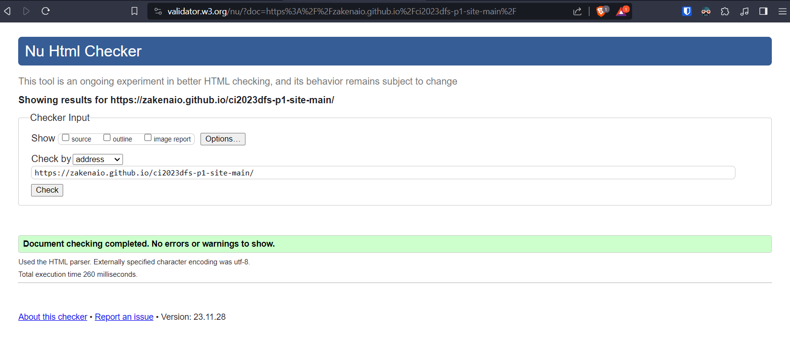

### CSS

I have used the recommended [CSS Jigsaw Validator](https://jigsaw.w3.org/css-validator) to validate all of my CSS files.
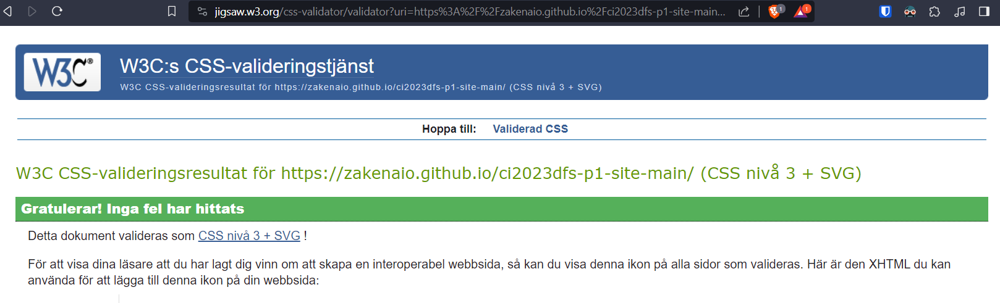

## Browser Compatibility

I've tested my deployed project on multiple browsers to check for compatibility issues.

| Windows 11 | Edge | Brave |  |
| --- | --- | --- | --- |
| |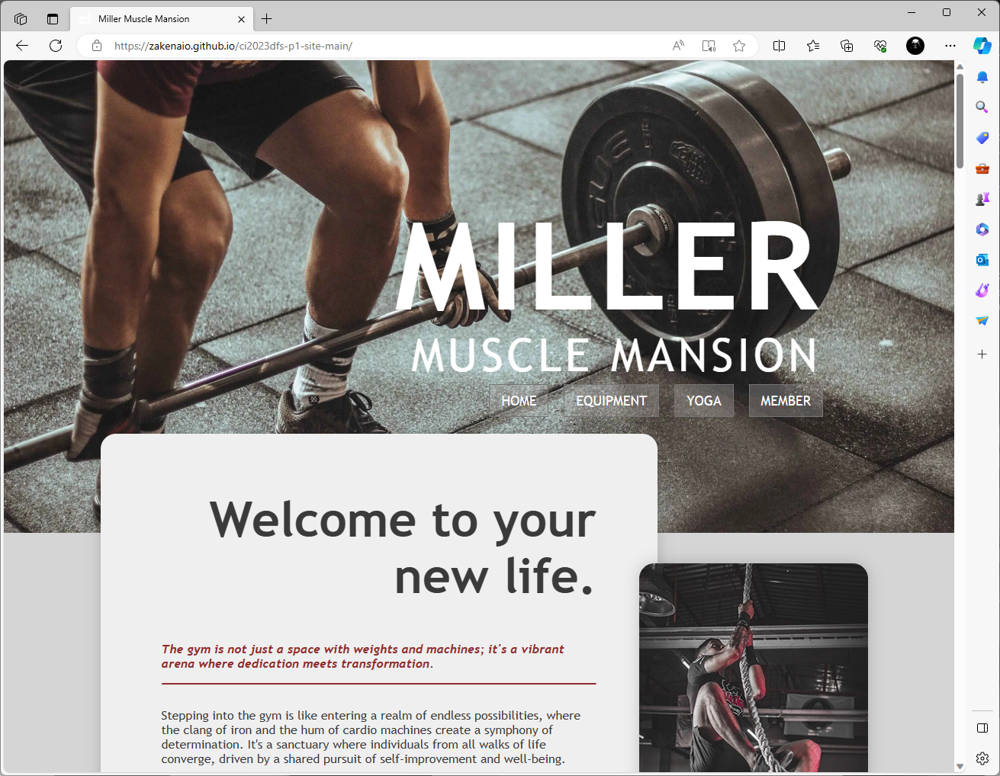|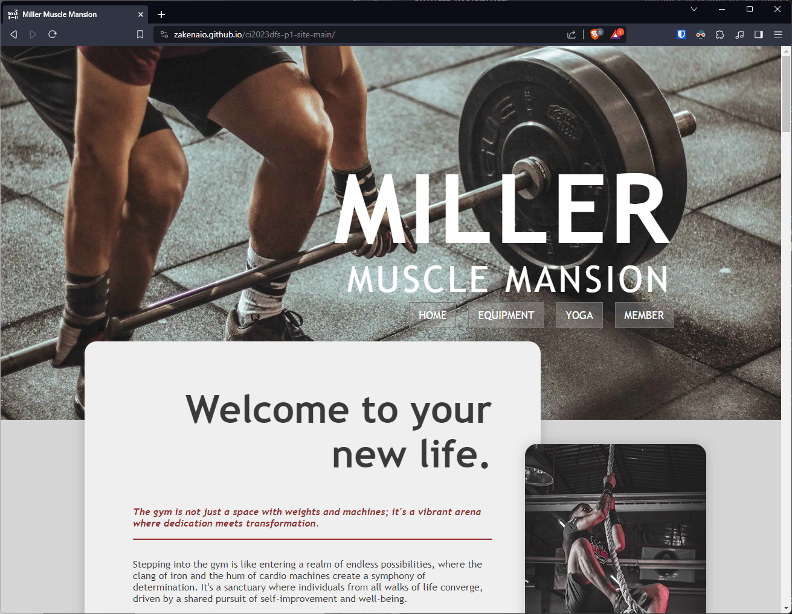|   |
| Linux (EndevourOS) | FireFox | Brave | Thorium |
| |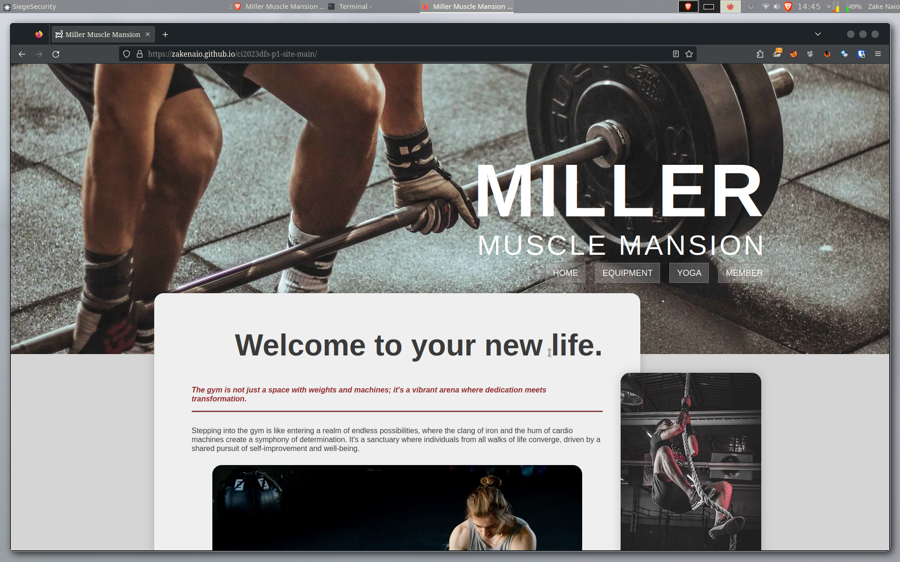|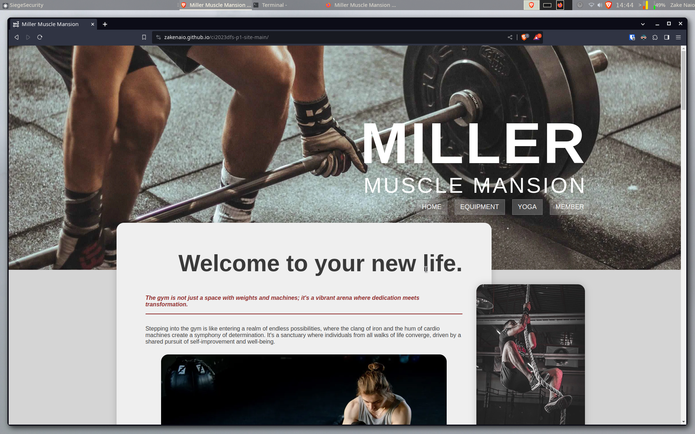|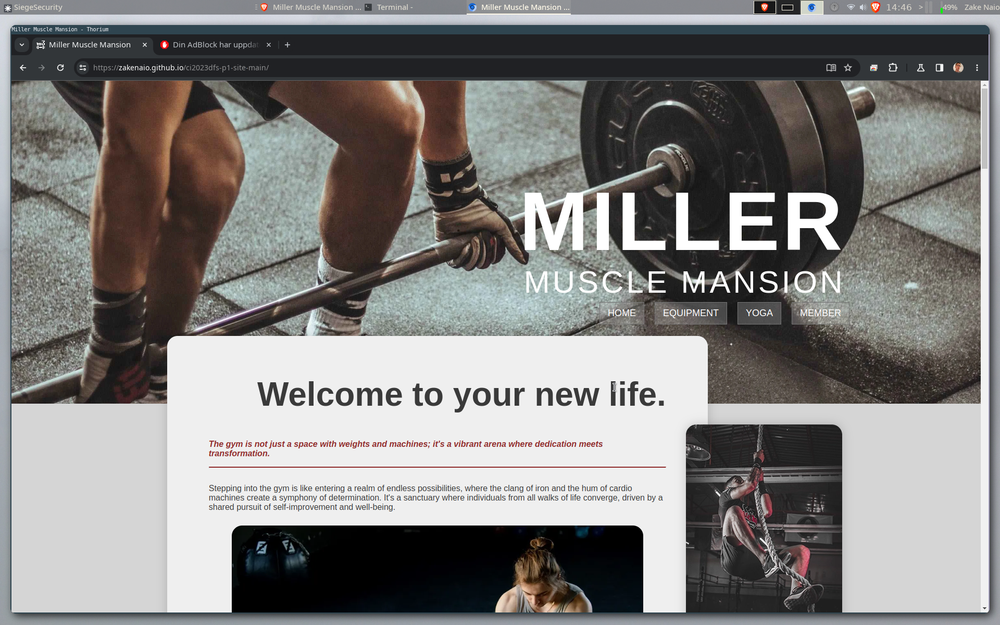 |
| MacOS Somoa | Safari | Brave | Firefox |
| |||   |

## Responsiveness

| Device | Screenshot | Notes |
| --- | --- | --- |
| Mobile (DevTools) | 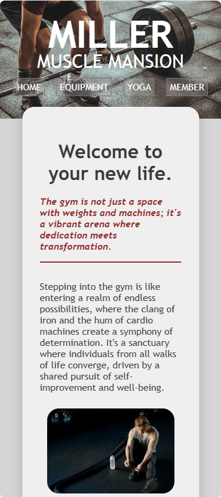 | Works as expected |
| Mobile Pixel 7 Pro | 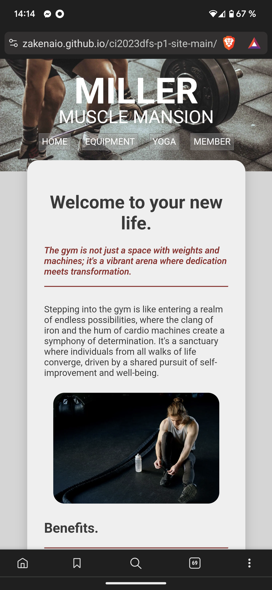 | Works as expected |
| Mobile Sony 1 ii | 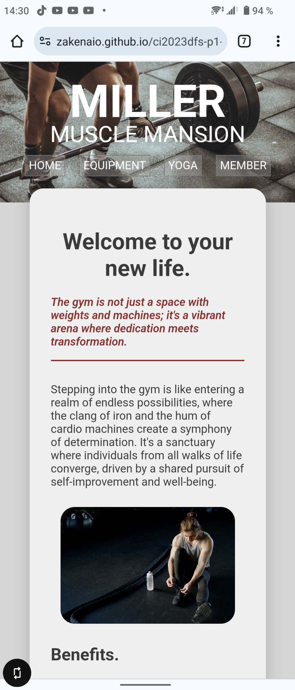 | Works as expected |
| Tablet (DevTools) | 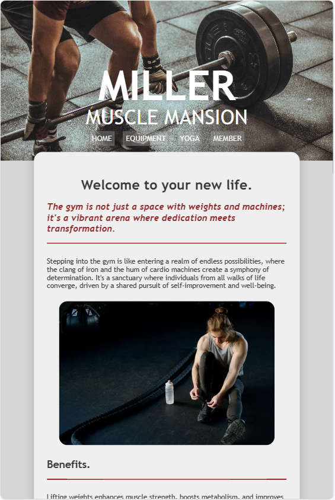 | Works as expected |
| Tablet (Lenovo) |  | Works as expected |
| Desktop 1080p | 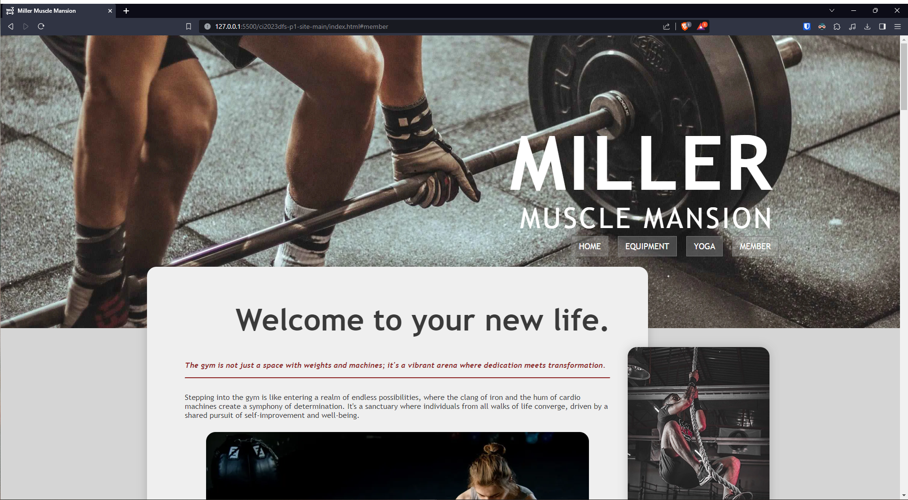 | Works as expected |
| Desktop 1440p | 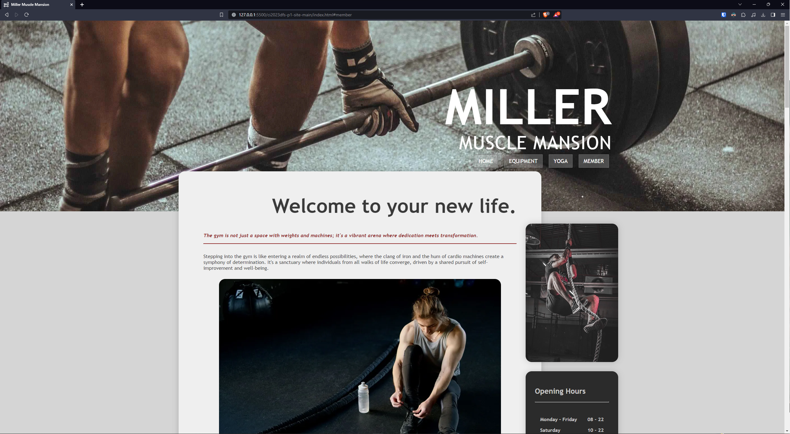 | Works as expected |

### Lighthouse Score

Desktop

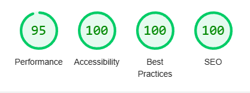

Mobile

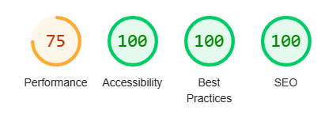

