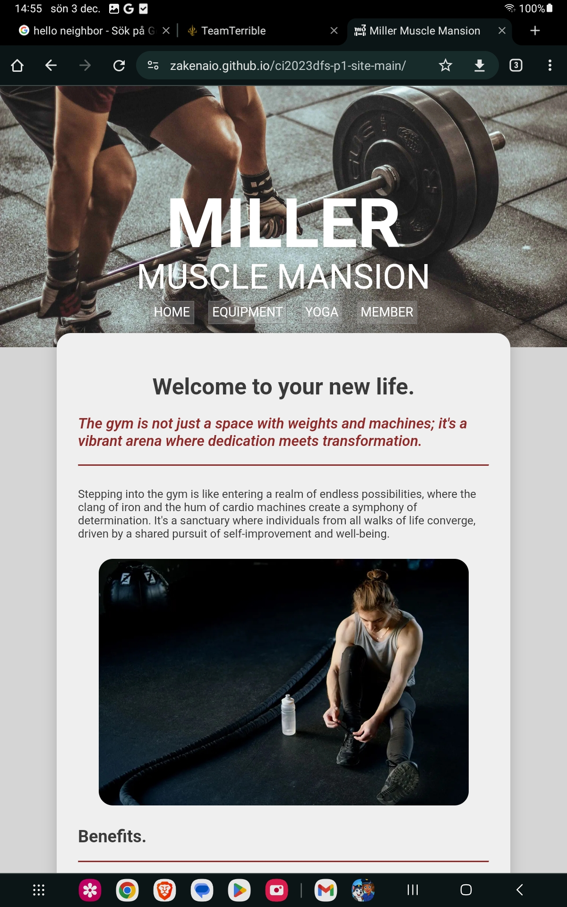
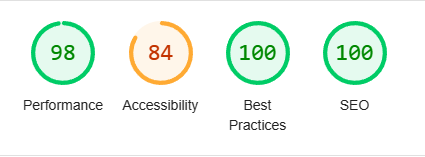
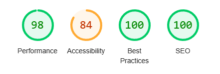

# Testing

Return back to the [README.md](README.md) file.

### HTML

I have used the recommended [HTML W3C Validator](https://validator.w3.org) to validate all of my HTML files

### CSS

I have used the recommended [CSS Jigsaw Validator](https://jigsaw.w3.org/css-validator) to validate all of my CSS files.

## UX Testing

Results of UX testing. 
Results of UX testing. 
#### **Navigation Bar:**
**Expected Behavior:** Clicking on each button should navigate to the corresponding parallaxed section divider with content directly underneath.
**Result: PASS**. The navigation bar functions as intended, providing a smooth transition to the targeted sections.

#### **Top-Return Button:**
**Expected Behavior:** The button should appear after scrolling 20px. Clicking it should smoothly scroll back to the top.
**Result: PASS.** The button appears as expected, and its functionality seamlessly returns users to the top of the page with a smooth scrolling effect.

#### **Member Form:**
**Expected Behavior:** The form should require inputs for first name, last name, and email. After submission, users should be directed to a confirmation page, which automatically returns to the main site after 10 seconds. A message prompting the completion of the first missing field should appear.

**Results:**
**Field Validation: PASS**. The form prompts users to fill in the first missing field.
**Submission: PASS.** Clicking the submit button successfully navigates to the confirmation page.
**Confirmation Page Auto-Return: PASS.** The confirmation page automatically returns to the main page after 10 seconds.

These positive outcomes affirm that the website's key features, including navigation, user interaction elements, and form submissions, align with the expected behaviors. This successful UX testing underscores the project's commitment to providing a user-friendly and reliable experience for visitors.

## Browser Compatibility

I've tested my deployed project on multiple browsers to check for compatibility issues.

| Windows 11 | Edge | Brave |  |
| --- | --- | --- | --- |
| |||   |
| Linux (EndevourOS) | FireFox | Brave | Thorium |
|Here shows that Linux lacks the default font and reverts to Arial ||| |
| MacOS Sonoma | Safari | Brave | Firefox |
| |||   |

## Responsiveness

| Device | Screenshot | Notes |
| --- | --- | --- |
| Mobile (DevTools) |  | Works as expected |
| Mobile Pixel 7 Pro |  | Works as expected |
| Mobile Sony 1 ii |  | Works as expected |
| Tablet (DevTools) |  | Works as expected |
| Tablet (Samsung) |  | Works as expected |
| Desktop 1080p |  | Works as expected |
| Desktop 1440p |  | Works as expected |

## Lighthouse Audit

I've tested my deployed project using the Lighthouse Audit tool to check for any major issues.

Main page. 
| Desktop | Mobile |
| --- | --- |
|||

Confirmation page.
Here I get a slightly lower accessibility score because of my use of a "refresh" tag. More info [here](https://dequeuniversity.com/rules/axe/4.8/meta-refresh "Information about refresh tag"). 
| Desktop | Mobile |
| --- | --- |
|||
